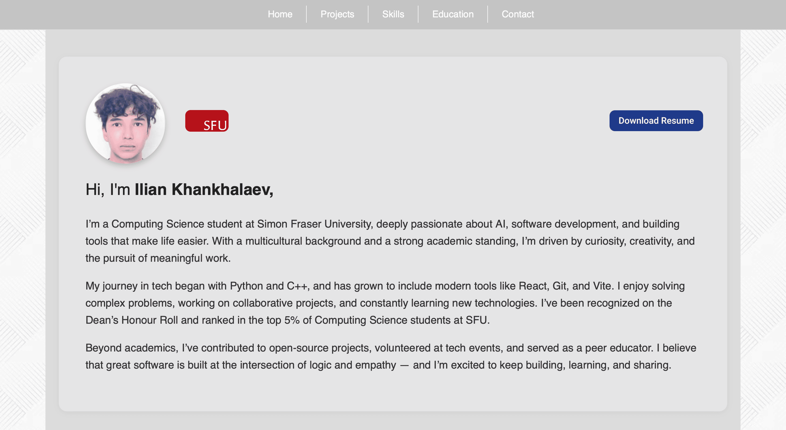

# Personal Portfolio Website

This is a responsive one-page portfolio website built with React and Vite. It showcases my projects, technical skills, academic background, and contact information. It is designed with alternating sections and clean UI to demonstrate component-based development and deployment using GitHub Pages.

## Live Demo

Check it out here: [florykhan.github.io](https://florykhan.github.io/portfolio-course-project/)

_One-page portfolio: hero, featured projects, skills, and contact_

## Technologies Used

- React
- Vite
- CSS (custom styling)
- Git & GitHub
- GitHub Pages (for deployment)

## Project Structure

- `src/components/` – Contains React components (NavBar, Hero, Projects, Skills, etc.)
- `public/` – Static assets (images, icons)
- `index.html` – Entry HTML file
- `index.css` – Global styling

## About Me

Hi! I'm Ilian Khankhalaev — a Computing Science student at Simon Fraser University, passionate about AI, software development, and creative problem-solving. I have experience in Python, C++, JavaScript, and frameworks like React.

Hobbies include classical piano, tennis, and snowboarding.

## Features

- Responsive layout
- Sticky navigation bar
- Hero section with profile image and SFU link
- Skills & projects with images and descriptions
- Academic achievements and experience
- Footer with clickable social links and resume

## License

This project is licensed under the MIT License.

> I chose the **MIT License** because it’s simple, permissive, and widely used. It allows others to reuse or modify the code with attribution, without imposing restrictions on how the code is used.

## GitHub Practices

- 10+ GitHub issues created with linked commits.
- Used feature branches and pull requests.
- Commit messages are clear and descriptive.
- Project includes a valid LICENSE file.
